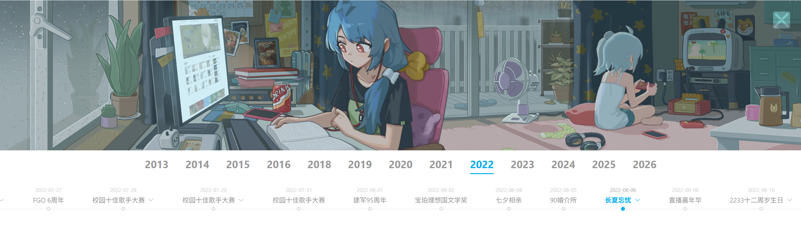

# Bilibili Banner 档案馆

一个围绕 Bilibili 首页 Banner 的历史档案与还原项目。

项目收集并整理了 2013 年至今的大部分首页 Banner，结合公开页面、历史快照与逆向分析结果，尽可能复现不同阶段的视觉表现与交互逻辑。

## 🚀 [在线预览](https://bilibili-banner.dankt.in/)

<div align="center">




</div>

## 🌟 核心特性

- 🕰️ **跨越十年的记录**：收录自 2013 年至今的大部分首页 Banner，覆盖从静态单图到多图层动态 Banner 的演变过程。
- 🎯 **动态交互还原**：基于逆向分析复现官方动态 Banner 的交互逻辑，包括视差、位移、模糊、转场等核心效果。
- 🕹️ **重现季节主题扩展**：重现 2022 年出现的春、夏、秋三个季性节主题网页互动小游戏和扩展。
- ⚙️ **工程化数据维护**：提供抓取、解析、校验和资源归档工具，方便新增数据并维护现有存档。

## 🛠️ 快速开始

### 1. 安装依赖

```bash
pnpm install
```

### 2. 本地开发

```bash
pnpm dev
```

### 3. 构建与预览

```bash
pnpm build
pnpm preview
```

## 📥 数据抓取指南

本项目当前只维护最新 Banner 抓取脚本。脚本会从 B 站当前首页和分区页提取 Banner 的图层数据、预览图、Logo 等资源，下载到本地后生成 `config.json`，并自动更新 `src/manifest/{YYYY}.json`。

抓取产物会归档到 `public/assets/{YYYY}/{MM}/{YYYY-MM-DD}-h{HH}-t{tid}[-preview]`。多图层 Banner 会同时生成正式条目和预览条目；重复资源默认会跳过，指定 `--tid` 时会强制重新抓取对应来源。

> [!IMPORTANT]
> 抓取脚本在自动运行完毕后，生成的 Banner 标题（`banner-title`）通常为网页的日期。因此在完成抓取后，**请手动编辑** [src/manifest/](src/manifest/) 目录下对应记录所在年份的配置文件（例如 [2026.json](src/manifest/2026.json)），修改对应记录的 `name` 属性。
> 
> ```diff
>   {
>     "date": "2026-01-09",
>     "refs": [
>       {
> -       "name": "2026-01-09",
> +       "name": "雪林候车",
>         "path": "2026-01-09-h00-t0",
>         "tags": ["split-layer"],
>         "tid": [0]
>       }
>     ]
>   }
> ```

### 1. 运行抓取

默认命令会依次抓取首页和所有已配置分区：

```bash
pnpm grab
```

如只需要抓取单个来源，可以使用 `--tid` 或 `-t`：

```bash
pnpm grab -- --tid 0
pnpm grab -- -t 1005
```

支持的参数：

| 参数 | 说明 |
| --- | --- |
| 不传 | 抓取首页和所有分区，并去重跳过已存在的 Banner |
| `--tid <id>` / `-t <id>` | 只抓取指定分区，多个分区用逗号分隔（例如 `-t 0,1005`）。0 代表主站首页。 |
| `--force`| 强制重新抓取对应来源（忽略去重步骤） |
| `-h, --help`| 显示帮助信息和支持的 tid 列表 |

当前支持的分区 id：

| id | 分区 | id | 分区 | id | 分区 | id | 分区 |
| --- | --- | --- | --- | --- | --- | --- | --- |
| `0` | 主站 | `1001` | 影视 | `1002` | 娱乐 | `1003` | 音乐 |
| `1004` | 舞蹈 | `1005` | 动画 | `1006` | 绘画 | `1007` | 鬼畜 |
| `1008` | 游戏 | `1009` | 资讯 | `1010` | 知识 | `1011` | 人工智能 |
| `1012` | 科技 | `1013` | 汽车 | `1014` | 时尚美妆 | `1015` | 家装房产 |
| `1016` | 户外潮流 | `1017` | 健身 | `1018` | 体育 | `1019` | 手工 |
| `1020` | 美食 | `1021` | 小剧场 | `1022` | 旅游出行 | `1023` | 三农 |
| `1024` | 动物 | `1025` | 亲子 | `1026` | 健康 | `1027` | 情感 |
| `1029` | vlog | `1030` | 生活兴趣 | `1031` | 生活经验 | | |

### 2. 数据管理与辅助校验

数据抓取完成后，可以使用以下命令对数据进行规范校验和清理：

| 命令                       | 说明                                                                       |
| -------------------------- | -------------------------------------------------------------------------- |
| `pnpm data validate`       | 校验 `public/assets` 中所有 Banner 的 `config.json` 配置是否符合 Schema 规范 |
| `pnpm data check-assets`   | 检查 `public/assets` 下资源引用的完整性（检查是否存在缺失或冗余资源）      |
| `pnpm data check-manifest` | 检查 Banner 配置的 tags 合法性以及配置与实际物理目录一致性                 |
| `pnpm data clean`          | 自动清理 `public/assets` 目录下的空目录                                    |

## ❤️ 鸣谢

- 感谢 [Bilibili][bilibili] 设计师们带来的精美艺术作品
- 早期开发参考：[palxiao/bilibili-banner](https://github.com/palxiao/bilibili-banner)

## 📄 协议与声明

- 代码部分采用 [MIT License](LICENSE)。
- 项目中的图片、视频及原始设计版权归 [Bilibili][bilibili] 所有。

[bilibili]: https://www.bilibili.com
